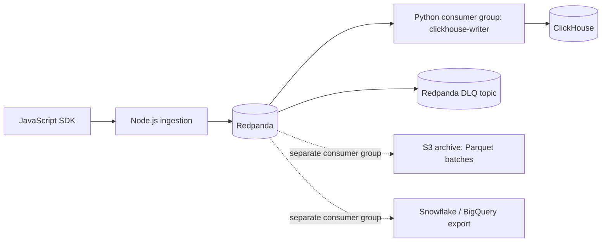

# Engineer-004 Real-Time Analytics Artifact

This repo is a runnable proof artifact for the real-time analytics pipeline plan. The written answer is `SUBMISSION.md`; the benchmark proof is `benchmark_results.txt`.



The hot path has exactly three components after the SDK: Node.js ingestion, Redpanda, and a Python writer to ClickHouse. S3 archival and warehouse export are separate consumer groups, so neither blocks dashboard freshness.

## Run Order

Fast reviewer path:

```bash
docker compose up -d
python pipeline.py init
python pipeline.py produce --count 25 --duplicates 1 --poison 1
python pipeline.py consume --max-records 27
python pipeline.py bench
python cost_model.py --check
python scripts/verify_submission.py
```

Real SDK gate, only when actual SDK source/test command is available:

```bash
docker compose up -d
SDK_COMMAND='node path/to/real-sdk-smoke-test.js' python sdk_contract.py
```

`pipeline.py bench` writes `benchmark_results.txt` with source labels on the measured and assumed numbers.

If no real SDK command is available, `python sdk_contract.py` exits `2`. Do not treat that as a pass; it means the dedup gate is still unverified, and the benchmark should report `real_sdk_contract_verified = 0`.

`scripts/verify_submission.py` is the packaging guardrail. It fails if the proof files are missing from git tracking/staging, if benchmark metrics are missing source labels, if the SDK gate stops returning the honest unverified status without `SDK_COMMAND`, or if the PII redaction benchmark markers are absent.

`SDK_EVIDENCE_CHECKLIST.md` states the exact evidence needed to turn `real_sdk_contract_verified = 0` into `1`.

`cost_model.py` renders `cost_model_results.txt`, an estimated AWS monthly run-rate model. The current model estimates `$27,968.10/month` with a 100 percent contingency against the brief's `$50,000/month` ceiling. It still requires an AWS Pricing Calculator export before production approval.

`AWS_LOAD_TEST_PLAN.md` defines the AWS validation gate that must pass before the local benchmark can be treated as a production SLA. `load/ingest_spike_k6.js` is the concrete load driver for the 5790 events/second spike test.

`SUBMISSION_MANIFEST.txt` records deterministic SHA-256 hashes for the proof packet. Regenerate it with `python scripts/build_submission_bundle.py --write` after any artifact change.

`EXTERNAL_VALIDATION_BLOCKERS.md` is generated by `scripts/check_external_readiness.py` and records the exact missing external inputs on this machine.

Once the SDK command, AWS identity, k6, and pre-production endpoint exist, run `scripts/run_external_validation.py` to capture the external evidence bundle.

Before uploading or pushing this submission from a local working tree, stage the full proof packet:

```bash
python scripts/check_external_readiness.py --write
python scripts/build_submission_bundle.py --write
git add .gitignore README.md SUBMISSION.md SUBMISSION_MANIFEST.txt PROOF_MATRIX.md EXTERNAL_VALIDATION_BLOCKERS.md POSITION_3.md SDK_EVIDENCE_CHECKLIST.md benchmark_results.txt cost_model.py cost_model_results.txt docker-compose.yml AWS_LOAD_TEST_PLAN.md load/ingest_spike_k6.js pipeline.py schema.sql sdk_contract.py scripts/build_submission_bundle.py scripts/check_external_readiness.py scripts/run_external_validation.py scripts/verify_submission.py
python scripts/verify_submission.py
```

For the written challenge answer, use `SUBMISSION.md`. This README is the repo/operator guide.

For reviewer navigation, use `PROOF_MATRIX.md`; it maps each required brief item and major constraint to the artifact that proves it.

## Correctness Model

This artifact does not claim exactly-once. The system stores raw at-least-once events and deduplicates at query time:

```sql
count(DISTINCT event_id)
```

That strategy is only valid if SDK retries reuse the same `event_id`. `sdk_contract.py` is a real harness for the actual SDK command supplied via `SDK_COMMAND`. It checks a normal HTTP 503 retry and a true lost-ACK retry where the server durably accepts the event, then drops the TCP connection before the client receives the ACK.

Segment queries are computed in ClickHouse, not Redis counters:

```sql
SELECT user_hash
FROM analytics.events
WHERE customer_id = ?
  AND timestamp >= now64(3) - INTERVAL 7 DAY
  AND user_hash IS NOT NULL
  AND event_name = 'pricing'
GROUP BY user_hash
HAVING count(DISTINCT event_id) >= 3
```

Anonymous users are excluded with `WHERE user_hash IS NOT NULL`, so anonymous retries do not create segment membership.

## Table Shape

`schema.sql` uses a ClickHouse `MergeTree` table partitioned by event date only:

```sql
PARTITION BY toDate(timestamp)
PRIMARY KEY (customer_id, timestamp, event_id)
```

ClickHouse quorum inserts are not used. A three-broker Redpanda cluster protects the durable log; ClickHouse can replay from Redpanda after writer failure.

## PII Properties Guardrail

The writer redacts common PII patterns from arbitrary event `properties` before inserting into ClickHouse. The benchmark sends a probe with an email address, phone number, IP address, and safe campaign property, then records redaction markers in `benchmark_results.txt`.

This is a minimal artifact guardrail, not a full compliance system. Production still needs a policy-backed DLP allowlist, customer contract language for custom fields, and a monitored exception flow.

## Known Tradeoffs

- Duplicates remain in raw storage. This is intentional; query-time `count(DISTINCT event_id)` collapses retry duplicates when the SDK contract passes.
- SDK retry correctness remains unverified until `SDK_EVIDENCE_CHECKLIST.md` is satisfied against the actual production SDK.
- Poison events go to the Redpanda `events.dlq` topic, not stderr, so failures are replayable and inspectable.
- S3 archival batches into Parquet on five-minute windows in the production design. It is not part of the hot commit path and is not implemented in this minimal artifact.
- GDPR deletion uses PII separation in the written plan: events keep a pseudonymous `user_hash`; PII lives outside this table. Deletion removes the PII row, leaving event history permanently pseudonymized. The artifact also redacts common PII patterns from custom event properties before ClickHouse storage.
- Budget proof is a source-labeled estimate in `cost_model_results.txt`, not an AWS bill. Production still needs the exact AWS Pricing Calculator export.
- Production SLA proof is defined in `AWS_LOAD_TEST_PLAN.md` and driven by `load/ingest_spike_k6.js`, not claimed from the local benchmark.
- Artifact integrity is tracked in `SUBMISSION_MANIFEST.txt`; it is a local packaging check, not independent external verification.
- If `sdk_contract.py` fails, do not build server-side dedup into this pipeline. Use `POSITION_3.md`.
