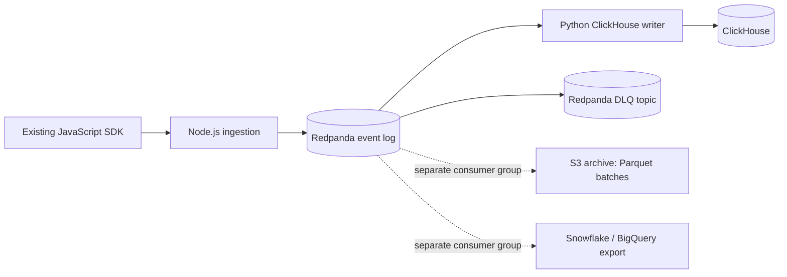

# Engineer-004 Submission: Real-Time Analytics Pipeline

Operating artifact: https://github.com/VasuBansal7576/beat-claude

## Decision

I would replace the current batchy analytics path with this hot path:



The hot path is intentionally small: Node.js ingestion writes accepted events to Redpanda, and [Observed artifact] one Python consumer group writes to ClickHouse. S3 archive and warehouse export are separate consumer groups, so they do not block dashboard freshness.

The artifact is the argument: `docker-compose.yml` runs the stack, `pipeline.py bench` produces `benchmark_results.txt`, and the benchmark file labels what is observed, estimated, and assumed.

I am optimizing for debuggability by the team in the brief: [Assumed from brief] twelve engineers, [Assumed from brief] two dedicated senior engineers, [Assumed from brief] three-month MVP timeline, [Assumed from brief] AWS stack, and [Assumed from brief] Python/Node/PostgreSQL/Redis familiarity. I am not choosing Flink because the operational surface is too large for this team and timeline. I am not choosing a Timestream hot store plus another OLAP store because ClickHouse can serve dashboard and segment queries from the same append-only event table, and this artifact measures that query path. I am also not claiming exactly-once processing or literal zero data loss. The system is durable at-least-once ingest, replayable from Redpanda, and query-deduplicated.

## Correctness Model

Raw duplicates are acceptable in storage. Dashboard and segment queries collapse SDK retry duplicates with:

```sql
count(DISTINCT event_id)
```

That is only valid if the real SDK preserves the same `event_id` across retries. The first artifact gate is therefore `sdk_contract.py`, which starts a raw TCP server and runs an actual SDK command supplied via `SDK_COMMAND`. It checks a normal retry after HTTP `503` and a lost-ACK retry where the server durably accepts the event and drops the TCP connection before the client receives the response. No production SDK source was provided with the challenge repo, so I do not claim that Path A is verified for Single Grain's actual SDK. If that real-SDK gate fails, `POSITION_3.md` is the decision: document that server-side SDK-retry dedup is not reliable for old SDK retries, do not add an idempotency store to the hot path, and fix the SDK contract as the durable path.

Segments stay in ClickHouse, not Redis counters, because retry duplicates would overcount Redis increments. Segment queries require:

```sql
WHERE user_hash IS NOT NULL
```

That excludes anonymous users from segment membership and uses pseudonymous identity for event analytics.

## Artifact Evidence

The repo contains a runnable artifact:

- `docker-compose.yml`: [Observed] three Redpanda brokers plus ClickHouse.
- `schema.sql`: ClickHouse table partitioned by event date only, primary key `(customer_id, timestamp, event_id)`.
- `sdk_contract.py`: real SDK retry contract harness; requires `SDK_COMMAND` pointing at an actual SDK smoke command.
- `SDK_EVIDENCE_CHECKLIST.md`: exact proof needed to convert `real_sdk_contract_verified = 0` to `1`.
- `pipeline.py`: `init`, `produce`, `consume`, and `bench` commands.
- `benchmark_results.txt`: benchmark output with source labels.
- `cost_model.py` and `cost_model_results.txt`: source-labeled AWS monthly run-rate estimate.
- `AWS_LOAD_TEST_PLAN.md` and `load/ingest_spike_k6.js`: production validation gate and load driver for the [Assumed from brief] 50M events/day and 10x spike load shape.
- `SUBMISSION_MANIFEST.txt`: deterministic SHA-256 manifest for proof-packet integrity.
- `PROOF_MATRIX.md`: map from brief requirements and constraints to proof artifacts.
- `EXTERNAL_VALIDATION_BLOCKERS.md`: current machine-readable blocker list for missing SDK/AWS/k6 access.
- `scripts/run_external_validation.py`: external evidence runner for the SDK contract, k6 spike test, AWS identity, and Cost Explorer capture once access exists.
- `POSITION_3.md`: decision path if the SDK retry contract fails.
- `scripts/verify_submission.py`: packaging guardrail; fails if required proof files are missing from git tracking/staging, benchmark metrics lose source labels, or the SDK-unverified gate stops behaving honestly.

Final local benchmark from `benchmark_results.txt`:

| Claim | Source label | Result | Proof tier |
|---|---:|---:|---|
| SDK retry harness exists | Observed | raw 503 and lost-ACK server implemented; real SDK command required | Tier 3: source record |
| Redpanda brokers configured | Observed | 3 | Tier 2/3: demo artifact/logs |
| ClickHouse writers | Observed | 1 | Tier 3: source code/logs |
| Real SDK contract verified | Observed local | 0; production SDK source not supplied | Tier 3: benchmark log/source record |
| End-to-end latency p50 | Observed local | 3975 ms | Tier 3: benchmark log |
| End-to-end latency p99 | Observed local | 3993 ms | Tier 3: benchmark log |
| Spike events sent | Observed local | 5790 | Tier 3: benchmark log |
| Spike events stored raw | Observed local | 5790 | Tier 3: ClickHouse source record |
| Spike events stored distinct | Observed local | 5790 | Tier 3: ClickHouse source record |
| Intentional retry raw events | Observed local | 1010 | Tier 3: benchmark log |
| Intentional retry distinct events | Observed local | 1000 | Tier 3: benchmark log |
| Duplicate rate under intentional retries | Observed local | 0.990 percent | Tier 3: benchmark log |
| PII properties guardrail | Observed local | email, phone, and IP redacted; safe campaign property preserved | Tier 3: benchmark log/source code |
| Segment seed window | Observed local | 7 days | Tier 3: benchmark log |
| Segment seed users | Observed local | 50000 | Tier 3: benchmark log |
| Cold-cache segment query p99 | Observed local | 25.766 ms | Tier 3: benchmark log |
| Poison events routed to DLQ | Observed local | 5 sent, 5 seen on Redpanda DLQ | Tier 3: Redpanda source record |
| Estimated AWS monthly run-rate | Estimated | $27,968.10 with 100 percent contingency; $22,031.90 under budget | Tier 3: source-labeled model |
| AWS production validation gate | Estimated plan | 5790 events/second spike, p99 freshness, parity, lag, broker-loss, cost gates, and k6 load driver defined | Tier 2: test plan artifact |

Important scope: these are local artifact measurements, not a production SLA. The production target remains [Assumed from brief] sub-five-second dashboard visibility at [Assumed from brief] fifty million events per day with spike tolerance, [Assumed from brief] more than five hundred customers, and [Assumed from brief] a fifty-thousand-dollar monthly infrastructure ceiling. This artifact proves the design is runnable and falsifiable. `AWS_LOAD_TEST_PLAN.md` and `load/ingest_spike_k6.js` define the production gate for AWS load tests, and `cost_model_results.txt` gives the first budget model; final launch approval still requires the AWS load-test evidence and exact AWS Pricing Calculator export.

The duplicate-rate benchmark uses intentional duplicate `event_id` values to prove the ClickHouse query model, not to prove the behavior of an unavailable production SDK. Real SDK behavior must be proven by running `sdk_contract.py` with `SDK_COMMAND` before enabling query-time SDK-retry dedup in production.

## Scale, Reliability, And Migration

For scale, Redpanda is the durable buffer. The ingestion service acknowledges only after Redpanda accepts the write. If ClickHouse is down, the writer stops and later replays from Redpanda. Poison events go to the `events.dlq` Redpanda topic, not stderr. Multi-tenant data is keyed by `customer_id`, and the ClickHouse primary key starts with `customer_id` so tenant/time-window dashboard queries scan the intended range.

For budget, the design avoids adding a managed stream-processing service to the hot path. `cost_model.py` estimates [Estimated] $27,968.10/month with a [Assumed] 100 percent contingency, leaving [Estimated] $22,031.90/month under the [Assumed from brief] fifty-thousand-dollar ceiling. This is still not a production bill: EC2 instance-hour prices are conservative placeholders, while EBS gp3, S3 Standard, and NAT unit prices are sourced from public AWS pricing pages checked on 2026-06-10. Production approval still needs an AWS Pricing Calculator export for the final region, instance classes, storage retention, ClickHouse deployment option, and data transfer path.

For GDPR and CCPA, I would separate PII from events. Events store `user_hash`; the PII table maps verified identity to the hash. Deletion means removing the PII row after human identity verification. Historical events remain usable but permanently pseudonymized. I would not use KMS key destruction for per-user deletion because waiting periods and shared-key blast radius make it the wrong primitive. The artifact now includes a minimal property-level PII guardrail: `pipeline.py` redacts common email, phone, and IP patterns before ClickHouse storage, and `benchmark_results.txt` records that the probe was redacted while a safe campaign property was preserved.

For migration, I would not dual-write to the broken system from application code. I would seed history from PostgreSQL logical replication/CDC, then mirror a sampled live copy from the ingestion layer to the new pipeline while the old path remains primary. Counts are compared by customer, event type, and time bucket. Cutover requires human sign-off after parity and latency checks pass.

## Tradeoffs And Failure Modes

This design sacrifices stream-processing expressiveness for operability. Complex stateful stream joins are slower to build than in Flink. I accept that because the brief is an analytics pipeline rebuild, not a stream-processing platform project.

What breaks it:

- The real SDK is unavailable or does not reuse `event_id` on retry. Mitigation: follow `POSITION_3.md`; do not claim query-time SDK-retry dedup works.
- Customers put PII in arbitrary event properties, referrer URLs, or custom fields. Mitigation: this artifact redacts common email, phone, and IP patterns before storage, but production still needs a policy-backed DLP allowlist, customer contract language, and a monitored exception flow.
- ClickHouse queries are written without `count(DISTINCT event_id)` or without `user_hash IS NOT NULL` for segment membership. Mitigation: ship query templates and tests around the segment definitions.
- Redpanda retention is undersized for ClickHouse outage/replay windows. Mitigation: size retention against the recovery-time objective before production.
- The cost model is wrong because final AWS instance classes, data transfer, support, or retention differ from assumptions. Mitigation: attach the AWS Pricing Calculator export before launch and rerun `cost_model.py`.
- Local benchmark results are treated as production proof. Mitigation: label them local observed values and require the `AWS_LOAD_TEST_PLAN.md` pass/fail gates before launch.

## What Stays Human

GDPR deletion identity verification stays human because a mistaken deletion is a legal and customer-trust failure. Migration phase gates stay human because the decision requires business risk ownership, not just metric thresholds. Incident escalation after [Assumed policy] fifteen minutes stays human because customer communication, rollback, and scope calls require judgment.

## AI Usage Disclosure

I used ChatGPT/Codex to help structure the architecture critique, create the runnable artifact, debug Redpanda HTTP proxy behavior, and draft this submission packet. I personally chose the architecture constraint, the SDK retry gate as the first decision, the no-exactly-once correctness model, PII separation for GDPR deletion, and CDC/shadow migration. I checked the runnable commands, benchmark output, schema shape, Redpanda topic replication, ClickHouse row counts, and DLQ records against the local system before treating the artifact as evidence.
